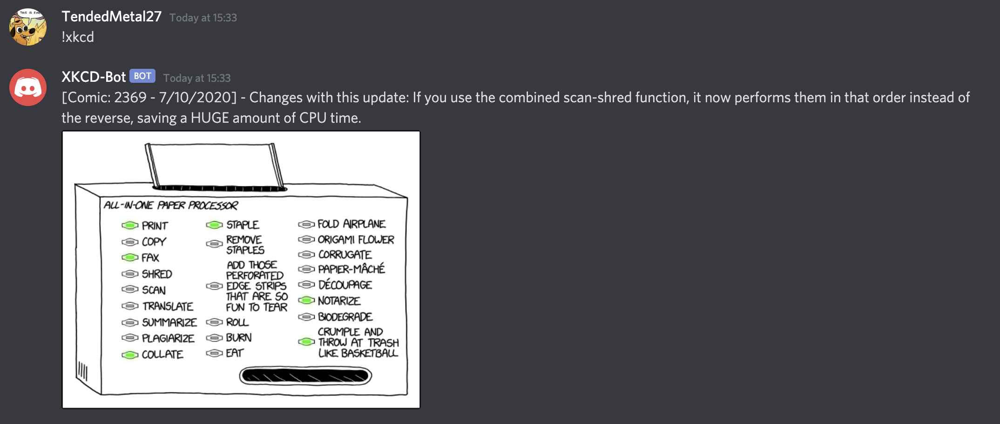
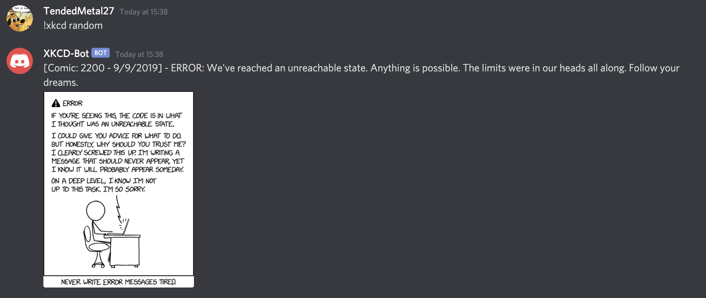

# XKCD-Discord-Bot

This is a bot that posts XKCD comics directly into discord channels when called to do so by a user.

### Most Recent

### Specific Comic

### Random Comic

## Commands:

!xkcd - Returns the most recent comic.

!xkcd {num} - Returns comic with number {num} (For example, !xkcd 1392)

!xkcd random - Returns random comic.

!xkcd help - Displays help menu

## Setup:

1. Clone this repo & cd into it

2. Rename 'TEMPLATE.config.json' to 'config.json' & add your token into it. You can also change the settings of it if you want:

   - **token** - The bot token required to create and run a bot.
   - **prefix** - The character you want commands to start with. For example: '!' & '\$'.
   - **channels** - An string array of all channel IDs that you want the bot to listen on. If a command is sent from a channel that is not listed in this array, the bot will ignore the command.

3. Install required packages with `npm i`.

4. Start it with `node server.js` or if you want it to restart automatically if it crashes (hopefully won't happen) use `nodemon server.js`
